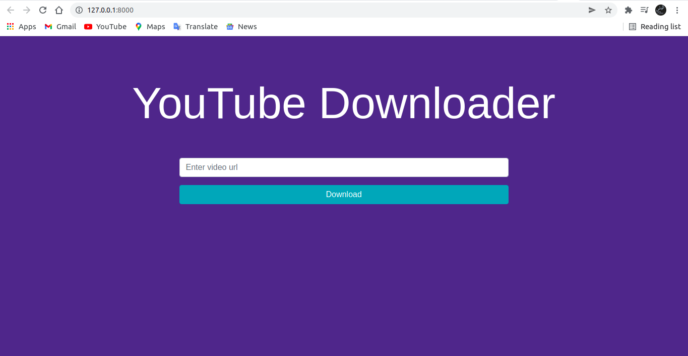

# Youtube Downloader

Youtube Downloader is a Python Web application built with Django.




# FEATURES!

  - Download Youtube videos in every format ranging rom 144p to Full HD.
  - Easy to use, userfriendly UI.


# REQUIREMENTS
  - This App Uses Python 3.7, pafy, Django 2.1, youtube-dl.

# INSTALLATION

Install the dependencies and devDependencies and start the server.

```sh
$ git clone https://github.com/Rufilboy/Youtube-Downloader.git
$ cd Youtube-Downloader
$ pip install -r requirements.txt
$ python manage.py runsever
```

## Contributing
Pull requests are welcome. For major changes, please open an issue first to discuss what you would like to change.

Please make sure to update tests as appropriate.

## License
This project is [MIT](https://choosealicense.com/licenses/mit/) Licensed.